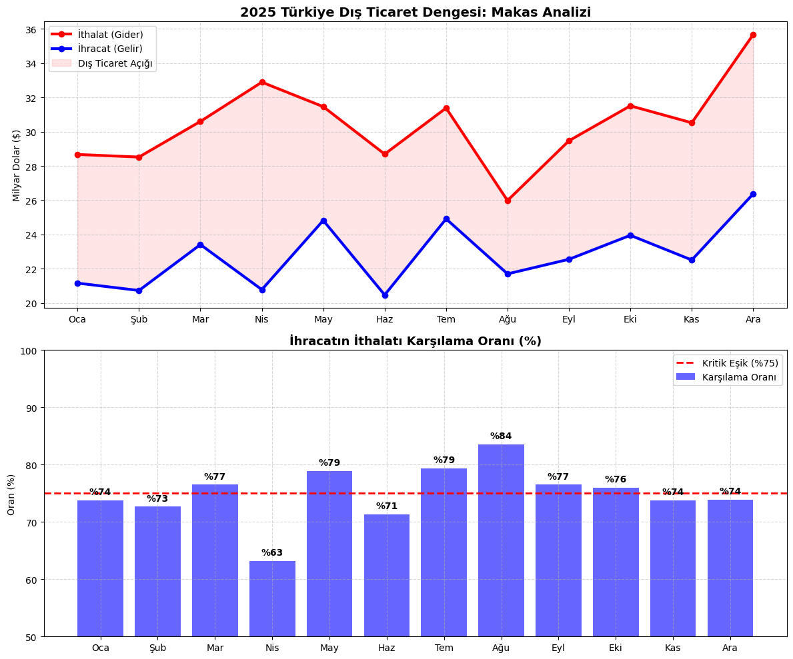
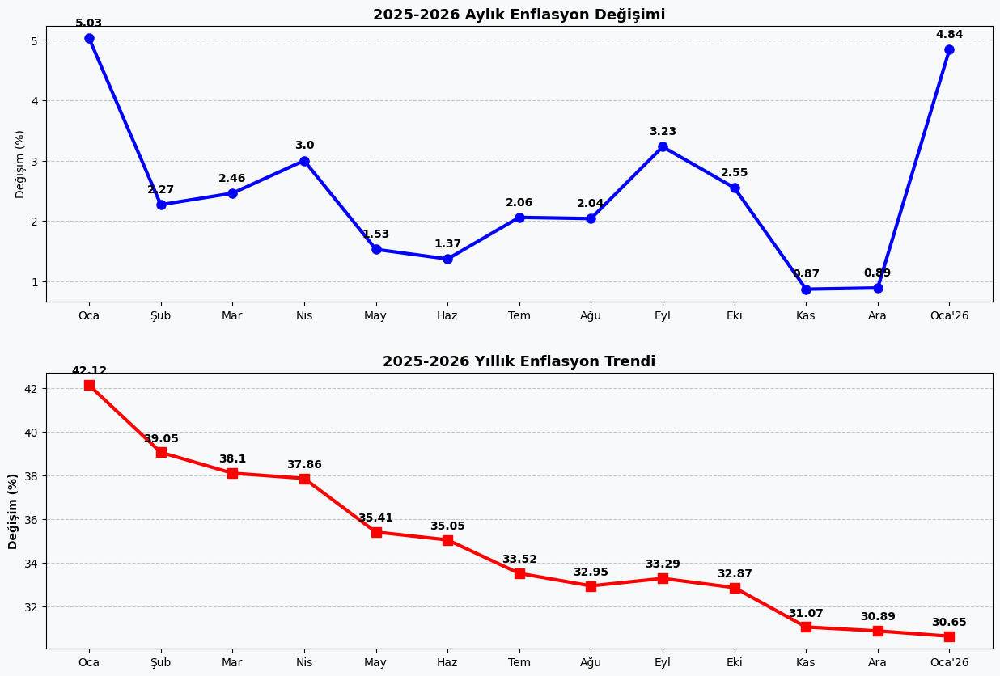

Bu repo, yerleşik iktisadi teorileri çağdaş veri bilimi araçlarıyla telif etmeyi amaçlayan disiplinlerarası bir araştırma ve görselleştirme portfolyosudur. Bir iktisat öğrencisi olarak bu projeyi hayata geçirmekteki temel gayem; makro ve mikro ölçekteki ekonomik verilerin yalnızca cansız rakamlardan ibaret olmadığını, aksine toplumların refah düzeyini ve piyasa dinamiklerini şekillendiren uzvi birer mekanizma olduğunu ortaya koymaktır.

Günümüzün bilgi yoğun dünyasında, iktisadi gerçekliği kavramak artık sadece formüllere vakıf olmaktan değil, ham veriyi işleyip ondan anlamlı hakikatler çıkarabilmekten geçmektedir. Bu çalışma; Türkiye ekonomisinin yapısal dinamiklerini ve birimlerin stratejik davranışlarını Python ekosistemi üzerinden modelleyerek şeffaf bir analiz laboratuvarı sunmayı hedefler. Burada sergilenen her grafik, bir kod satırının ötesinde, belirli bir iktisadi mantığın ve metodolojik titizliğin mahsulüdür.

### Güncel Analizler ve İktisadi Yorumlar
### 1. Dış Ticaret Dengesi ve "Makas" Analizi
Türkiye ekonomisinin küresel ticaret ağındaki konumunu ve dış denge dinamiklerini anlamak için "Makas Analizi" hayati bir araçtır. Bu çalışma, sadece ihracat ve ithalatın nominal değerlerini değil, yerli üretimin ithalata bağımlılığını ve rekabet gücünü de tetkik eder.
Grafikte izlenen ihracatın ithalatı karşılama oranı, bir ülkenin dış şoklara karşı mukavemetini temsil eder. İktisat literatüründe %75-80 bandı sürdürülebilirlik açısından kritik bir eşik olarak kabul edilir. Türkiye'nin enerji maliyetleri ve ara malı gereksinimi nedeniyle bu makasın açılması, cari denge üzerinde baskı oluşturmaktadır. Bu görselleştirme, katma değerli üretimin dış ticaret açığını kapatmadaki rolünü somutlaştırmaktadır.

### 2. 2025 Enflasyon Trendi ve Dezenflasyon Süreci
Enflasyon analizi, fiyat artış hızı takibinin yanı sıra ekonomi yönetiminin dezenflasyon hedefleriyle piyasa gerçeklerinin muvazenesini (dengesini) ölçmektir. Bu analizde, 2025 yılı verilerini, açıklanan 2026 Ocak ayı verileriyle harmanlayarak güncel bir tablo sunmayı hedefledim.
Grafikte yıllık bazda %30,65’e doğru sınırlı bir gerileme (baz etkisi) görülse de, Ocak ayındaki %4,84’lük aylık artış, yeni yılın fiyatlama davranışlarını net bir şekilde ortaya koyuyor. Ulaştırma ve gıda kalemlerindeki maliyet artışlarının belirleyici olduğu bu süreçte, asgari ücret düzenlemelerinin yansımasıyla aylık seride son bir yılın en belirgin hareketini gözlemliyoruz.

Bu çalışmada rakamlar kadar dikkat çekici bir diğer nokta ise metodolojik değişimdir. TÜİK, hesaplama yönteminde artık baz yılı 2003 yerine **2025** olarak esas almakta ve enflasyon sepetini robot süpürge gibi güncel harcama alışkanlıklarını yansıtacak şekilde modernize etmektedir. Hazırladığım bu görselleştirme, metodolojik güncellemelerin makro veriler üzerindeki somut etkisini analiz etmeyi amaçlamaktadır.

### Teknik Altyapı
Veri çekme ve temizleme süreçlerinde Pandas, görselleştirme standartlarında ise Matplotlib kullanılmaktadır. Veri kaynakları olarak TÜİK, TCMB ve Ticaret Bakanlığı veri setleri baz alınmaktadır.

### İletişim
https://www.linkedin.com/in/haticeelg%C3%B6rm%C3%BC%C5%9F013/

